<div align="center">


# 🎬 Prince Cinema
### Full-Stack Cinema Management System

**A complete, production-ready platform for modern cinema operations.**
Two dedicated apps — one for your customers, one for your team.

<br/>

[](https://android.com)
[](#)
[](#)
[](#)

</div>

---

## 📌 Table of Contents

- [Overview](#-overview)
- [Cinema App — Customer Side](#-cinema-app--customer-experience)
- [Admin Control App — Operator Side](#%EF%B8%8F-admin-control-app--operations-dashboard)
- [App Architecture](#-app-architecture)
- [Feature Highlights](#-feature-highlights)
- [Screenshots](#-screenshots)
- [Licensing & Acquisition](#-licensing--acquisition)

---

## 📖 Overview

**Prince Cinema** is a dual-app Android platform that digitizes and streamlines every aspect of running a cinema — from online seat booking to back-office revenue analytics. Built for real-world cinema operations, the system handles the complete ticket lifecycle, concession management, staff workflows, advertisement delivery, and financial reporting — all from a mobile-first interface.

<br/>

| | App | Target Users | Purpose |
|--|-----|-------------|---------|
| 🎟️ | **Cinema App** | General Public | Browse movies, pick seats, book tickets, get confirmations |
| 🎛️ | **Admin Control** | Cinema Staff & Management | Run daily operations, analytics, scheduling, and settings |

> **This repository is a product showcase.** Source code is private and available for licensing. See [Licensing & Acquisition](#-licensing--acquisition).

---

## 🛠️ Tech Stack

| Layer | Technology |
|-------|-----------|
| 📱 **Frontend** | Flutter (Dart) |
| ☁️ **Backend & Database** | Firebase (Firestore, Auth) |
| 🖼️ **Media Management** | Cloudinary |

---

## 🚀 Live on Google Play Store

Both apps are live and available for download on the **Google Play Store**.

| App | Audience |
|-----|----------|
| 🎟️ [**Cinema App**](https://play.google.com/store/apps/details?id=com.princecine.prince_cinema&pcampaignid=web_share) | General Public — Browse, book, and get tickets |
| 🎛️ [**Admin Control App**](https://play.google.com/store/apps/details?id=com.princecine.prince_cinema_admin&pcampaignid=web_share) | Cinema Staff — Full operations dashboard |

---


## 📱 Cinema App — Customer Experience

A premium, dark-themed booking experience designed to make every step — from discovery to confirmation — feel effortless.

---

### 🏠 Home


The home screen serves as a dynamic launchpad for the cinema's current programme.

- **Hero banner** — full-screen featured movie with genre label and Watch Trailer shortcut
- **Today's Shows** — horizontal scroll of all currently screening movies
- **Bottom navigation** — persistent access to Home, Schedule, and Movies
- Poster-first visual design keeps the experience rich and cinematic

<br clear="right"/>

---

### 🎥 Movie Detail


Every movie gets a dedicated detail page with everything a customer needs to commit to a booking.

- Large poster with an embedded **Watch Trailer** button (YouTube)
- Full synopsis with expandable "Read More"
- Genre tags and runtime badge
- Complete cast listing
- Prominent **View Schedule & Book** call-to-action

<br clear="right"/>

---

### 📅 Schedule Browser


Customers can explore what's playing across multiple days without friction.

- **Date selector** — scroll through Today, Tomorrow, and upcoming days
- Shows grouped and listed with movie posters and showtimes
- **Swipe carousel** on the Movies tab for browsing the full catalogue
- Available seats update in real-time as bookings come in

<br clear="right"/>

---

### 💺 Interactive Seat Map


The standout feature of the booking flow — a live, visual hall layout.

- Full grid view of the entire cinema hall
- **Seat categories:** Hall (standard) and Gallery (premium), visually differentiated
- **Colour-coded states:** Available · Selected · Gallery · Booked
- Price total updates live as seats are tapped
- Clean **Buy Tickets** button anchored at the bottom with a running cost display

<br clear="right"/>

---

### ✅ Booking Confirmation


A reassuring, information-complete confirmation screen that closes the booking loop cleanly.

- Clear **Booking Confirmed** status with a unique booking reference code
- One-tap reference copy to clipboard
- Full booking summary: movie, date, and showtime
- Customer contact details displayed for verification
- Choice to **download a PDF ticket** or collect a printed ticket at the counter

<br clear="right"/>

---

## 🎛️ Admin Control App — Operations Dashboard

A powerful, role-aware back-office platform organized into four control modules. Accessed via a slide-out navigation drawer, each module groups related actions to minimize taps and maximize operator efficiency.

---

### 🎬 MOVIES Control

<table>
<tr>
<td width="260">
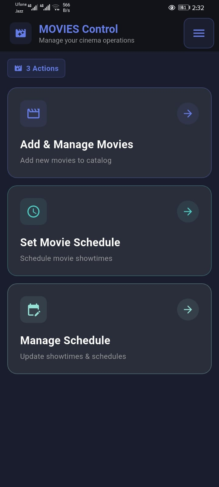
</td>
<td>

The complete movie management hub — from adding a new title to scheduling its entire run.

Three actions cover the full lifecycle:
- **Add & Manage Movies** — build and maintain the catalogue
- **Set Movie Schedule** — create showtimes with Single Day or Bulk mode
- **Manage Schedule** — update or remove existing shows

</td>
</tr>
</table>

#### Add & Manage Movies

<table>
<tr>
<td width="260">
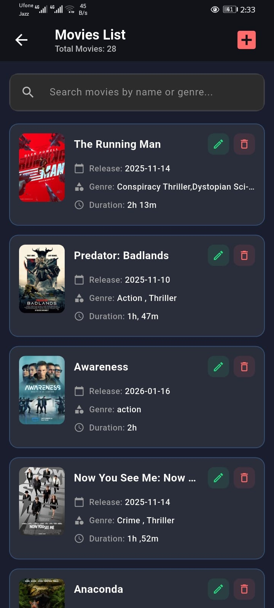
</td>
<td width="260">
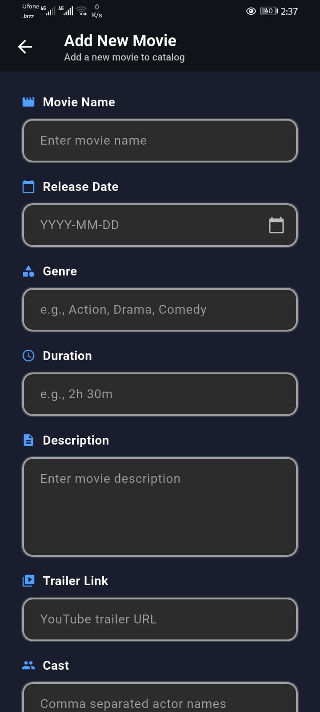
</td>
<td>

- Add movies with full metadata: title, release date, genre, duration, synopsis, YouTube trailer link, and cast
- Browse the catalogue with poster thumbnails and key details at a glance
- Search by name or genre
- Per-movie **Edit** and **Delete** controls

</td>
</tr>
</table>

#### Set Movie Schedule — Bulk Mode

<table>
<tr>
<td width="260">
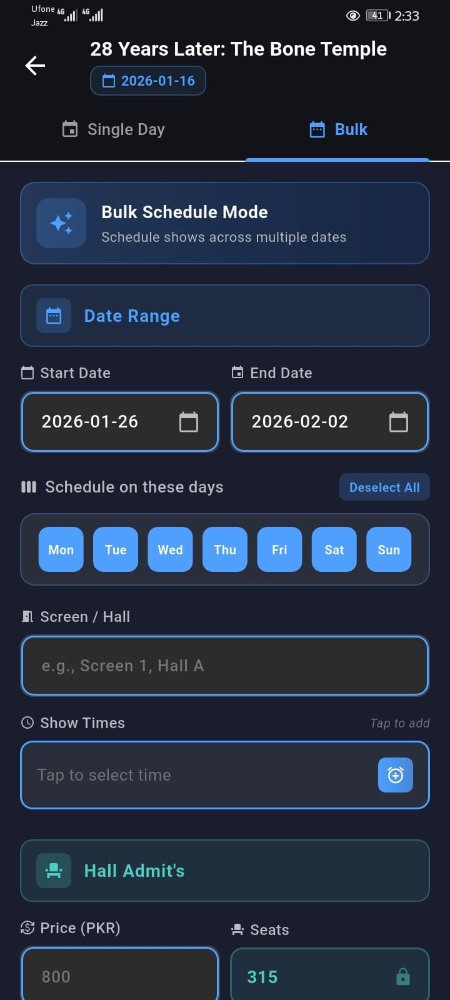
</td>
<td>

- **Single Day** mode for one-off scheduling
- **Bulk Schedule** mode — select a date range, pick days of the week, add showtimes, and schedule the entire run in one operation
- Assign a named Screen or Hall per schedule entry
- Set ticket price and seat capacity — capacity auto-locks to the configured hall size

</td>
</tr>
</table>

---

### 🎟️ ADMITS Control

<table>
<tr>
<td width="260">
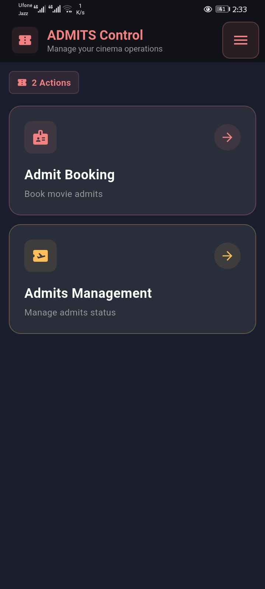
</td>
<td>

Everything related to ticket issuance and booking management in one place.

Two actions cover the full admits workflow:
- **Admit Booking** — issue tickets directly from the admin app
- **Admits Management** — search, filter, and review all bookings

</td>
</tr>
</table>

#### Admit Booking

<table>
<tr>
<td width="260">
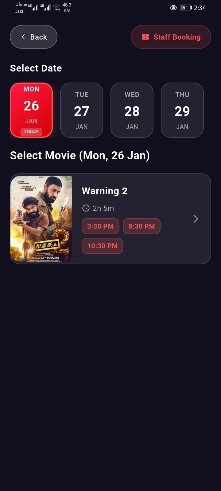
</td>
<td>

- Staff can book tickets directly from the admin app on behalf of walk-in customers
- Date and movie selector surfaces all available showtimes for the chosen day
- Dedicated **Staff Booking** mode for internal and complimentary admissions — tracked separately from customer revenue

</td>
</tr>
</table>

#### Admits Management

<table>
<tr>
<td width="260">
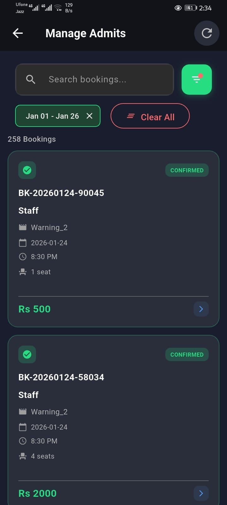
</td>
<td>

- Searchable, filterable list of all bookings across any date range
- Filter by booking type, payment method, or date
- Each record displays: reference ID, movie, date, showtime, seat count, amount, and confirmation status
- Staff bookings are visually distinct from customer bookings throughout

</td>
</tr>
</table>

---

### 📊 ANALYTICS Control

<table>
<tr>
<td width="260">
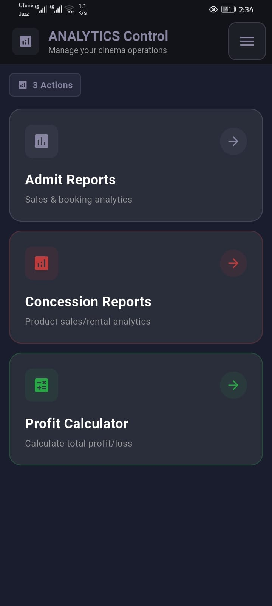
</td>
<td>

Three dedicated reporting tools that give management a complete picture of business performance.

- **Admit Reports** — ticket sales and booking analytics
- **Concession Reports** — POS and product sales analytics
- **Profit Calculator** — full P&L across all revenue sources

</td>
</tr>
</table>

#### Admit Reports

<table>
<tr>
<td width="260">
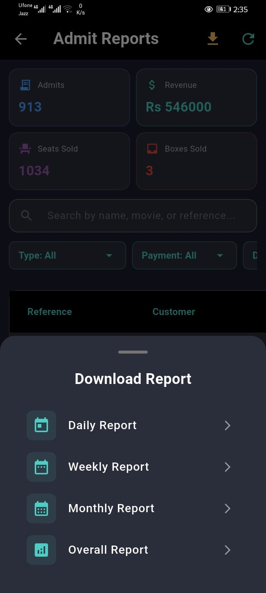
</td>
<td width="260">
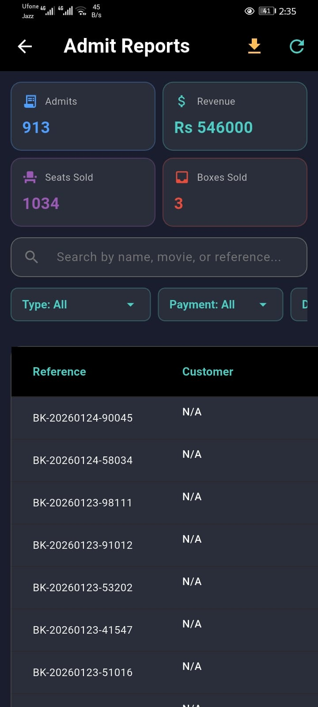
</td>
<td>

- Top KPI tiles — total admits, revenue, seats sold, and box seats sold — always visible at a glance
- Full transaction log searchable by customer name, movie, or booking reference
- Filters: booking type (Hall / Gallery / Box) and payment method
- Downloadable reports: **Daily · Weekly · Monthly · Overall**

</td>
</tr>
</table>

#### Concession Reports

<table>
<tr>
<td width="260">
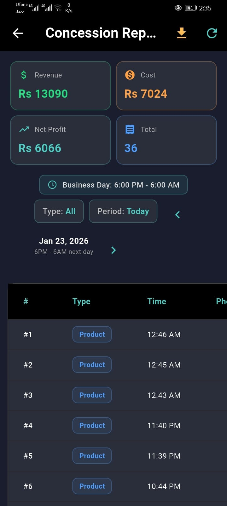
</td>
<td width="260">
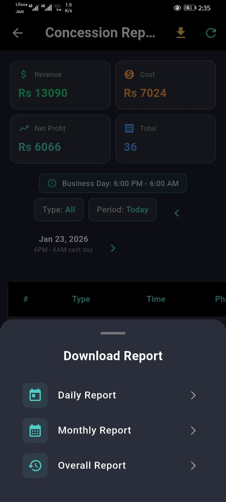
</td>
<td>

- Tracks revenue, cost, and net profit for all POS and concession sales
- **Configurable Business Day window** — define the operating hours that constitute a "day" to match real cinema schedules rather than calendar midnight
- Itemized transaction log with timestamps and sale type
- Period selector: today or any custom date range
- Downloadable reports: **Daily · Monthly · Overall**

</td>
</tr>
</table>

#### Profit Calculator

<table>
<tr>
<td width="260">
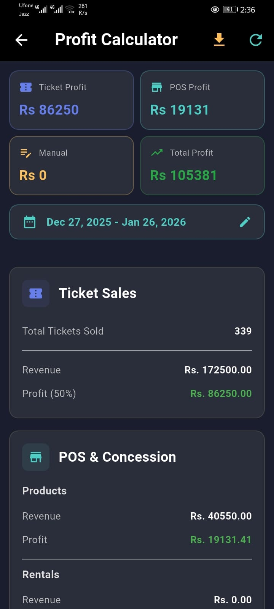
</td>
<td>

- Full P&L summary for any selected date range
- Breaks down profit by source: Ticket Sales, POS & Concessions (Products + Rentals), and Manual Adjustments
- Ticket profit calculated at the cinema's configured revenue-share percentage
- Downloadable PDF summary report for accounting and ownership review

</td>
</tr>
</table>

---

### ⚙️ SETTINGS Control

<table>
<tr>
<td width="260">
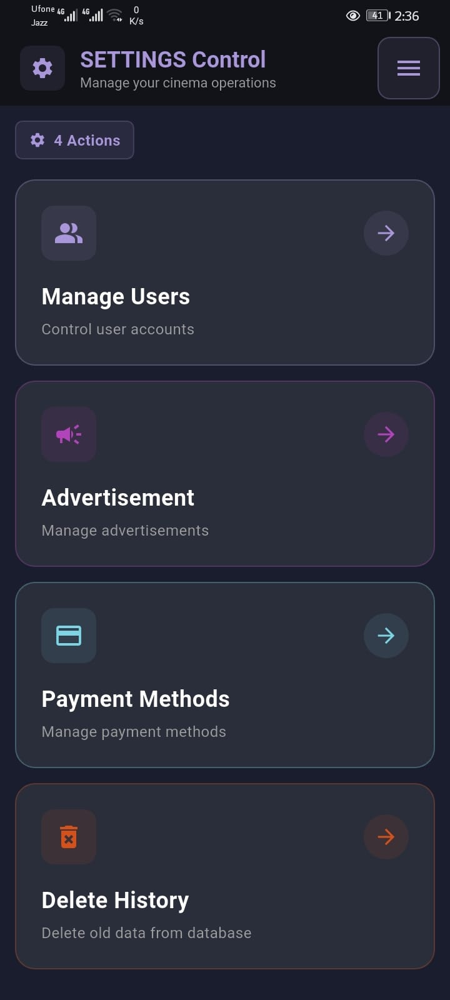
</td>
<td>

System configuration and administration — four tools that keep the platform running correctly.

- **Manage Users** — staff accounts and role-based access
- **Advertisement** — manage banners shown inside the customer app
- **Payment Methods** — configure accepted payment options
- **Delete History** — safely clean up old operational data

</td>
</tr>
</table>

#### Manage Users

- Create and manage staff accounts with individual credentials
- Role-based access ensures each staff member only sees the modules relevant to their position

#### Advertisement Management

<table>
<tr>
<td width="260">
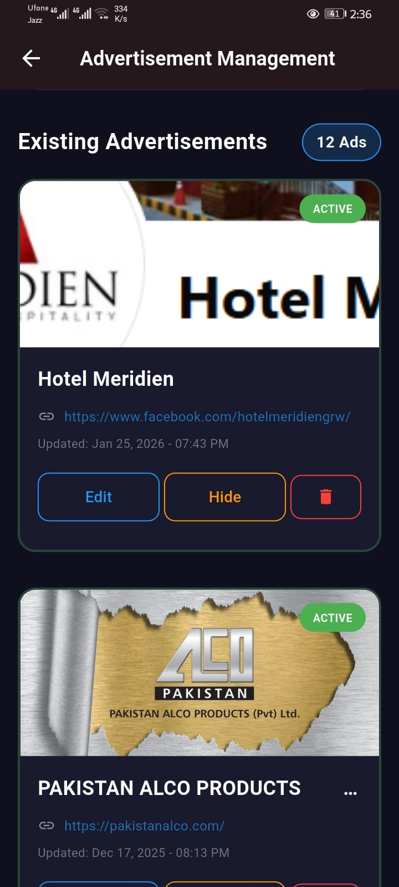
</td>
<td>

- Upload and manage promotional banners that appear inside the customer-facing Cinema App
- Each advertisement supports a banner image, a display title, and an external link
- Toggle ads between **Active** and **Hidden** without permanently removing them
- Full **Edit / Hide / Delete** controls per advertisement entry

</td>
</tr>
</table>

#### Payment Methods

<table>
<tr>
<td width="260">
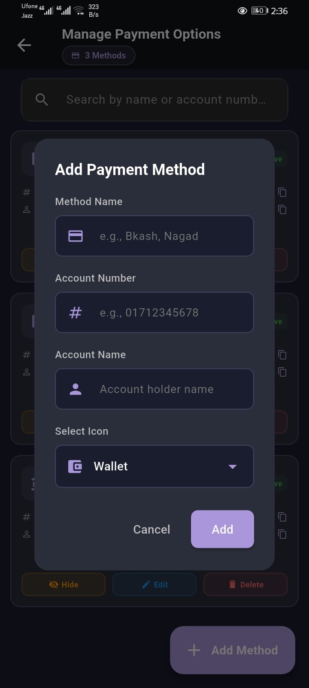
</td>
<td>

- Configure which payment options are presented to customers at checkout
- Add any method with: name, account number, account holder name, and display icon
- Supports any local wallet or payment service (e.g. JazzCash, Bkash, Nagad, cash)
- Manage and update without requiring a code change or app update

</td>
</tr>
</table>

#### Delete History

<table>
<tr>
<td width="260">
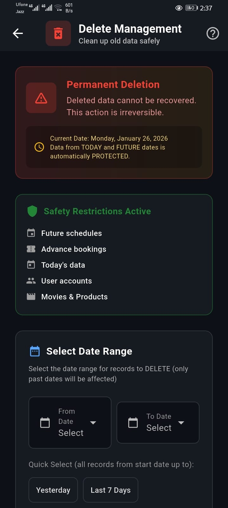
</td>
<td>

A safe, controlled tool for cleaning up old operational data.

- Prominent warning screen — permanent deletion is never accidental
- **Automatic data protection:** today's records and all future-dated entries are locked and cannot be selected for deletion regardless of the chosen range
- Protected categories: future schedules, advance bookings, today's activity, user accounts, movies, and products
- Flexible date range picker with quick-access presets for common cleanup tasks

</td>
</tr>
</table>

---

## 🧭 App Architecture

```
📱 Cinema App  (Customer-Facing)
│
├── 🏠 Home
│   ├── Featured Movie Carousel
│   └── Today's Shows
│
├── 🕐 Schedule
│   └── Browse by Date & Showtime
│
└── 🎥 Movies
    ├── Full Catalogue Browse
    └── Movie Detail
        ├── Trailer · Synopsis · Cast
        └── Book Now
            ├── Date & Time Selection
            ├── Interactive Seat Map
            └── Confirmation + PDF Ticket
```

```
🎛️ Admin Control App  (Operator-Facing)
│
├── 🎬 MOVIES
│   ├── Add & Manage Movies
│   ├── Set Schedule ─── Single Day / Bulk Mode
│   └── Manage Schedule
│
├── 🎟️ ADMITS
│   ├── Admit Booking ── Customer + Staff Modes
│   └── Admits Management
│
├── 📊 ANALYTICS
│   ├── Admit Reports ────── Daily / Weekly / Monthly / Overall
│   ├── Concession Reports ─ Configurable Business Day Window
│   └── Profit Calculator ── Multi-Source P&L with Revenue Share
│
└── ⚙️ SETTINGS
    ├── Manage Users
    ├── Advertisement Management
    ├── Payment Methods
    └── Delete History ── Auto-Protection on Current & Future Data
```

---

## ✨ Feature Highlights

| Feature | Description |
|---------|-------------|
| 🗺️ **Interactive Seat Map** | Real-time visual hall layout with live booking state, seat categories, and dynamic pricing |
| 📆 **Bulk Scheduling Engine** | Schedule a full movie run across a date range and multiple weekdays in a single operation |
| 🕐 **Configurable Business Day** | Custom operating hour windows for accurate daily reporting that reflects real cinema schedules |
| 📊 **Multi-Source P&L Calculator** | Combines ticket revenue share, POS, concessions, and manual adjustments into one P&L view |
| 🛡️ **Safe Delete System** | Auto-protects current and future data — past records only, with confirmation gates |
| 📄 **Multi-Level Downloadable Reports** | PDF exports for admits, concessions, and profit at daily, monthly, and all-time levels |
| 🎟️ **Staff Booking Mode** | Internal and complimentary bookings tracked separately from customer transactions |
| 📢 **In-App Advertisement Delivery** | Admin-managed banners served live inside the customer-facing app — no update required |
| 💳 **Flexible Payment Configuration** | Any local wallet or payment method added and managed entirely from the admin panel |
| 🔐 **Role-Based Staff Access** | Granular account management ensures staff see only what their role requires |

---

## 📸 Screenshots

### 🎟️ Cinema App

| Home | Movie Detail | Schedule | Seat Map | Confirmation |
|:----:|:-----------:|:--------:|:--------:|:------------:|
|  |  |  |  |  |

### 🎛️ Admin Control App

| Navigation | Movies | Bulk Schedule | Admits | Admit Reports |
|:----------:|:------:|:-------------:|:------:|:-------------:|
| 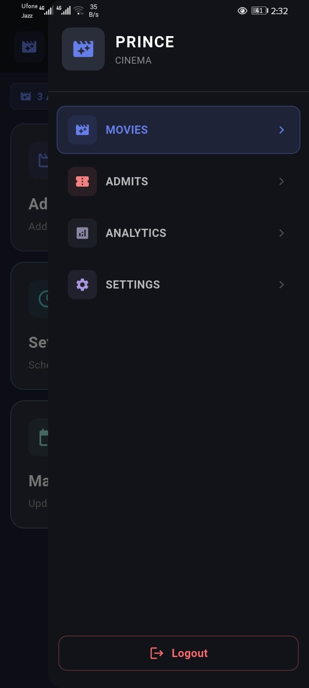 |  |  |  |  |

| Analytics | Concessions | Profit Calculator | Advertisements | Delete Management |
|:---------:|:-----------:|:-----------------:|:--------------:|:-----------------:|
|  |  |  |  |  |

---

## 💼 Licensing & Acquisition

This platform is **production-proven** and available for licensing or full acquisition. Whether you are a cinema operator looking to deploy immediately, or a business looking to own and build on top of the product, the following options are open for discussion.

| Option | What's Included |
|--------|----------------|
| 🏢 **Deployment License** | Full system deployed, branded, and configured for your cinema |
| 💻 **Source Code License** | Complete Android source code for both apps |
| 🔄 **White-Label License** | Fully rebranded version customized to your business identity |
| 🤝 **Full Acquisition** | Complete ownership transfer of the product and all source assets |

**To inquire, open an [Issue](../../issues) or reach out via the contact on this profile.**

---

## 🔒 Repository Notice

This repository is a **public product showcase only**. The source code for both apps is proprietary and not publicly available. All screenshots are taken from a live production deployment.

---

<div align="center">

**Prince Cinema — Built for Operators. Loved by Audiences.**

*Your Entertainment — Our Screen*

</div>