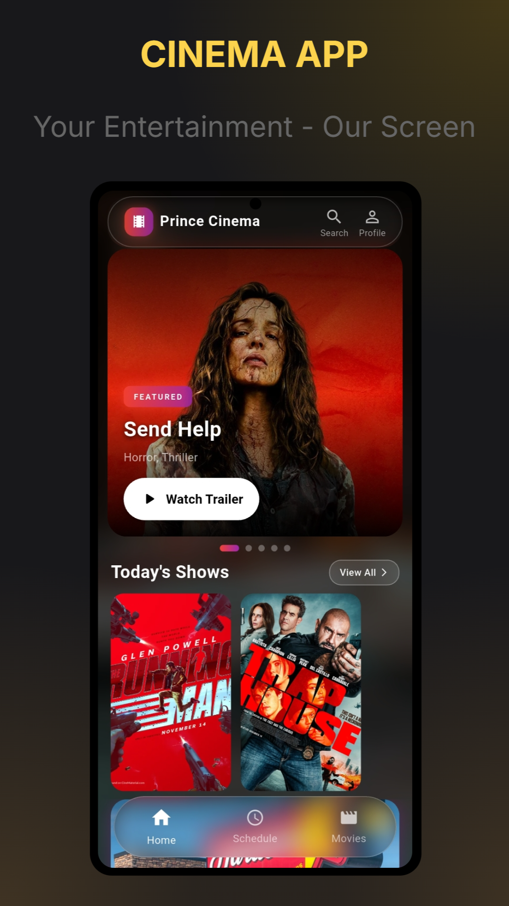
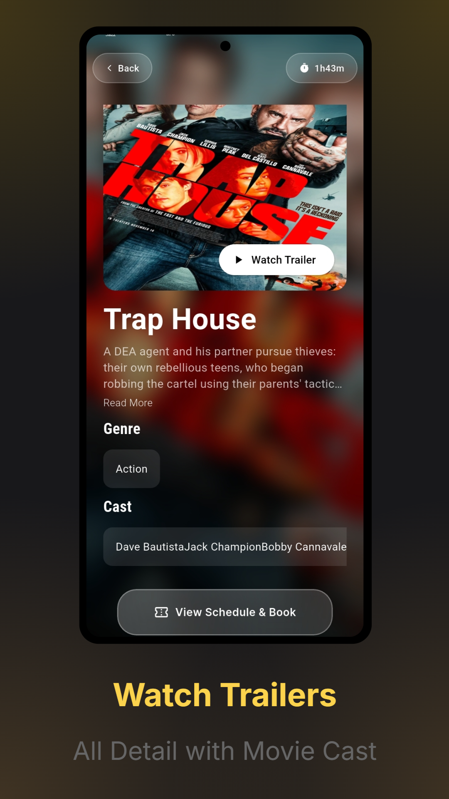
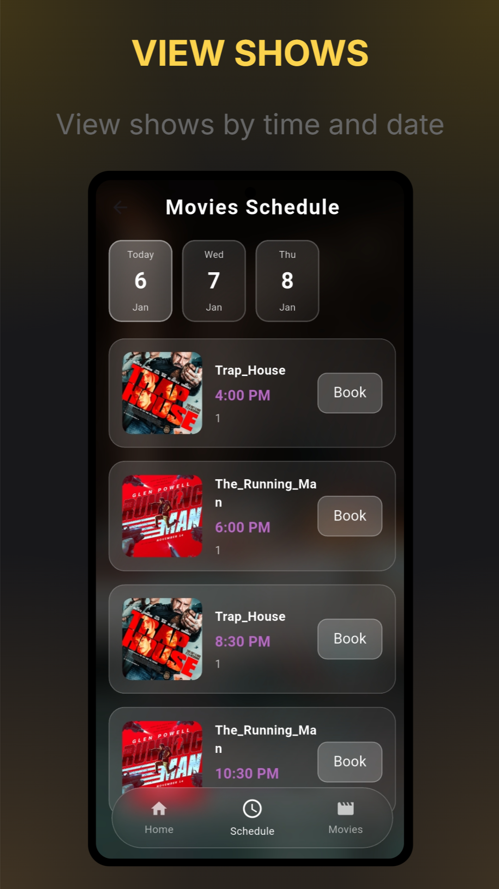
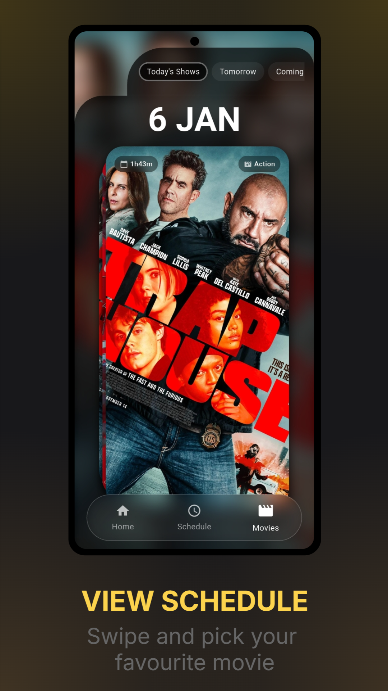
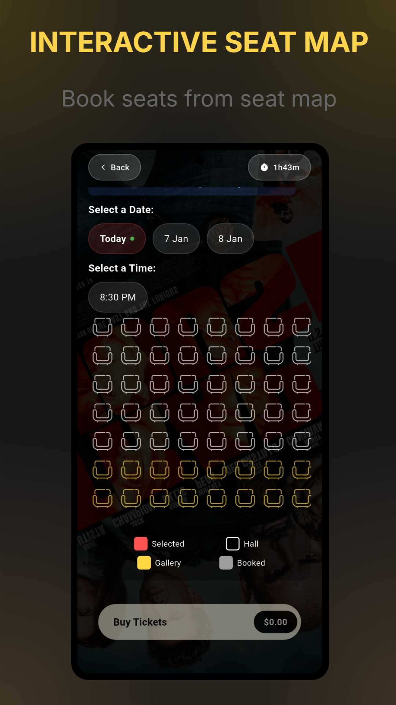
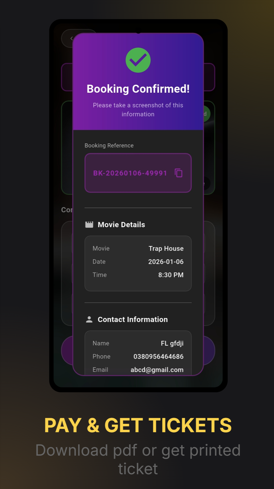

# 🎬 Prince Cinema — Full-Stack Cinema Management System

<div align="center">


**A complete, production-ready cinema operations platform built for the modern multiplex.**  
Two dedicated apps — one for customers, one for operators — working in perfect sync.


</div>

---

## 📖 Overview

**Prince Cinema** is a dual-app system designed to run every aspect of a cinema business — from customer-facing ticket booking to back-office analytics and staff management. The platform is purpose-built for cinema operators and supports real-world cinema workflows.

| App | Audience | Core Purpose |
|-----|----------|-------------|
| 🎟️ **Cinema App** | General Public | Browse movies, view schedules, book seats from dynamic seatmap, and get tickets |
| 🎛️ **Admin Control** | Cinema Staff & Management | Manage movies, admits, revenue, advertisements, and settings |

> **Note:** Source code is private. This repository documents the product's UI/UX, features, and business logic.

---

## 📱 Cinema App — Customer Experience

The customer-facing app delivers a premium movie booking experience with a sleek dark-themed interface.

### 🏠 Home Screen


- **Featured Movie Banner** — Full-screen promotional carousel with trailer button
- **Today's Shows** — Quick-access horizontal scroll of current screenings
- **Bottom Navigation** — Home · Schedule · Movies
- Rich movie posters and branding throughout

<br clear="right"/>

---

### 🎥 Movie Detail Page


Each movie page contains everything a customer needs to make a booking decision:

- Full movie poster with **Watch Trailer** button (YouTube integration)
- Synopsis with "Read More" expand
- Genre tags and runtime badge
- Complete **Cast** list
- Direct **View Schedule & Book** CTA

<br clear="right"/>

---

### 📅 Schedule & Show Browser




- **Date-scrollable schedule** — browse Today, Tomorrow, and upcoming dates
- Shows listed by movie with showtime chips
- **Swipe-to-browse** movie carousel on the Movies tab
- Real-time seat availability per show

<br clear="right"/>

---

### 💺 Interactive Seat Map


One of the app's flagship features — a fully interactive hall layout:

- **Visual seat grid** showing the complete cinema hall
- Seat categories: **Hall** (standard) · **Gallery** (premium)
- Real-time status: Available · **Selected** (red) · **Gallery** (gold) · **Booked** (grey)
- Running total updates as seats are selected
- **Buy Tickets** button with live price calculation

<br clear="right"/>

---

### ✅ Booking Confirmation


Post-booking flow is clean and informative:

- **Booking Confirmed** screen with unique reference (e.g. `BK-20260106-49991`)
- One-tap reference copy to clipboard
- Full movie details: title, date, showtime
- Customer contact info summary
- Option to **download PDF ticket** or collect a printed ticket at the counter

<br clear="right"/>

---

## 🎛️ Admin Control App — Operations Dashboard

A comprehensive back-office platform for cinema operators, organized into four major control modules accessible via a slide-out navigation drawer.

---

### 🎬 MOVIES Control


**3 Actions** — full movie lifecycle management:

#### Add & Manage Movies


- Add movies with: Name, Release Date, Genre, Duration, Description, Trailer Link (YouTube), Cast
- Browse all 28+ movies with poster thumbnails, genre, runtime
- Search by name or genre
- Edit / Delete controls per movie

<br clear="right"/>

#### Set Movie Schedule — Bulk Mode


- **Single Day** or **Bulk Schedule** mode
- Bulk Mode: define a date range, select days of week (Mon–Sun), add multiple showtimes in one operation
- Assign Screen / Hall per schedule
- Set Hall price (PKR) and seat count — seat count is auto-locked from hall configuration

<br clear="right"/>

#### Manage Schedule
- Update or remove existing showtimes
- Full visibility into the upcoming schedule

---

### 🎟️ ADMITS Control


**2 Actions** — ticket booking and management:

#### Admit Booking


- Date selector with day-of-week display
- Movie selection by date with all available showtimes
- **Staff Booking** mode for complimentary/internal admissions

<br clear="right"/>

#### Admits Management


- Full booking list with search — 258 bookings shown in demo
- Filter by date range (e.g. Jan 01 – Jan 26)
- Each booking card: Reference ID · Movie · Date · Showtime · Seats · Amount · Status badge (CONFIRMED)
- Staff vs. customer booking distinction

<br clear="right"/>

---

### 📊 ANALYTICS Control


**3 Actions** — data-driven decision making:

#### Admit Reports


Real-time KPI tiles at the top:

| Metric | Value (Demo) |
|--------|-------------|
| Total Admits | 913 |
| Revenue | Rs 546,000 |
| Seats Sold | 1,034 |
| Boxes Sold | 3 |

- Searchable transaction table by name, movie, or reference
- Filter by **Type** (Hall / Gallery / Box) and **Payment** method
- Download: Daily · Weekly · Monthly · Overall Report

<br clear="right"/>

#### Concession Reports


- Revenue · Cost · Net Profit · Total transactions
- **Business Day** window configurable (demo: 6:00 PM – 6:00 AM)
- Period selector: Today / custom range
- Itemized transaction log by type and time
- Download: Daily · Monthly · Overall Report

<br clear="right"/>

#### Profit Calculator


Full P&L dashboard for a selected date range:

| Source | Amount (Demo: Dec 27 – Jan 26) |
|--------|-------------------------------|
| Ticket Profit (50%) | Rs 86,250 |
| POS & Concession Profit | Rs 19,131 |
| Manual Adjustments | Rs 0 |
| **Total Profit** | **Rs 1,05,381** |

- Ticket Sales: 339 tickets · Rs 172,500 revenue
- POS & Concession: Products + Rentals breakdown
- Downloadable PDF report

<br clear="right"/>

---

### ⚙️ SETTINGS Control


**4 Actions** — system configuration:

#### Manage Users
- Add, edit, and deactivate staff accounts
- Role-based access control

#### Advertisement Management


- 12 active ads in demo
- Upload banner images with external URL links
- Active / Hidden status toggle
- Edit / Hide / Delete controls per ad
- Ads displayed to customers in the cinema app

<br clear="right"/>

#### Payment Methods


- Manage accepted payment options (JazzCash, Bkash, Nagad, etc.)
- Fields: Method Name · Account Number · Account Name · Icon type
- 3 active payment methods in demo

<br clear="right"/>

#### Delete History (Data Management)


A carefully guarded data cleanup tool with built-in safety mechanisms:

- **Permanent Deletion** warning — irreversible action
- **Auto-Protection**: Today's and future data is automatically protected from deletion
- Safety Restrictions Active on: Future schedules · Advance bookings · Today's data · User accounts · Movies & Products
- Flexible date range selector with quick presets (Yesterday, Last 7 Days)

<br clear="right"/>

---

## 🧭 Navigation & App Architecture

```
Admin Control App
├── 🎬 MOVIES
│   ├── Add & Manage Movies
│   ├── Set Movie Schedule (Single Day / Bulk)
│   └── Manage Schedule
├── 🎟️ ADMITS
│   ├── Admit Booking
│   └── Admits Management
├── 📊 ANALYTICS
│   ├── Admit Reports
│   ├── Concession Reports
│   └── Profit Calculator
└── ⚙️ SETTINGS
    ├── Manage Users
    ├── Advertisement
    ├── Payment Methods
    └── Delete History
```

```
Cinema App (Customer)
├── 🏠 Home (Featured + Today's Shows)
├── 🕐 Schedule (Browse by Date)
└── 🎥 Movies
    └── Movie Detail → Seat Map → Booking Confirmation
```

---

## ✨ Key Technical Highlights

- **Real-time sync** between admin scheduling and customer-facing showtime availability
- **Interactive seat map** with live booking state management
- **Bulk scheduling engine** — one operation schedules across a full date range and multiple days of week
- **Business Day** concept for concession reports (non-calendar day windows, e.g. 6 PM – 6 AM)
- **Safe delete system** with automatic protection of current and future data
- **Downloadable PDF reports** for Admits, Concessions, and Profit
- **Role-aware booking** — staff bookings tracked separately from customer bookings
- **PKR currency** support throughout with local payment gateway integration

---

## 📸 Screenshots

> All screenshots are from a live production deployment at **Prince Cinema**.

### Customer App
| Home | Movie Detail | Schedule | Seat Map | Booking Confirmed |
|------|-------------|----------|----------|-------------------|
|  |  |  |  |  |

### Admin App
| Main Menu | Movies | Schedule (Bulk) | Admit Reports | Profit Calculator |
|-----------|--------|----------------|---------------|-------------------|
|  |  |  |  |  |

| Concession Reports | Advertisement | Payment Methods | Delete Management | Manage Admits |
|-------------------|---------------|-----------------|-------------------|---------------|
|  |  |  |  |  |

---

## 🔒 Repository Notice

This repository serves as a **public showcase** of the Prince Cinema platform. The source code is proprietary and not available for public access. All screenshots are from a live production deployment.

---

<div align="center">

**Built with ❤️ for Prince Cinema**  
*Your Entertainment — Our Screen*

</div>